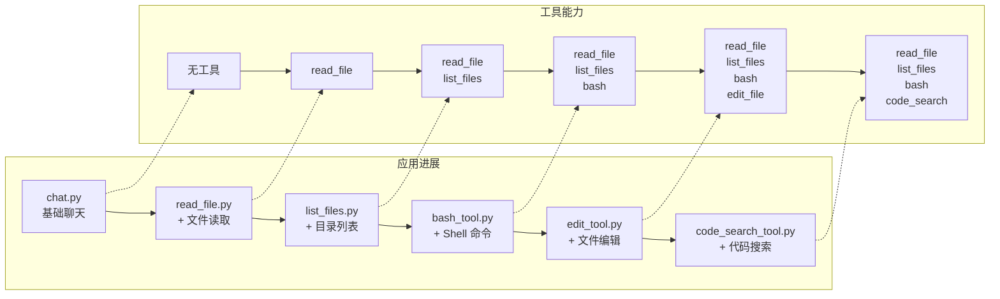
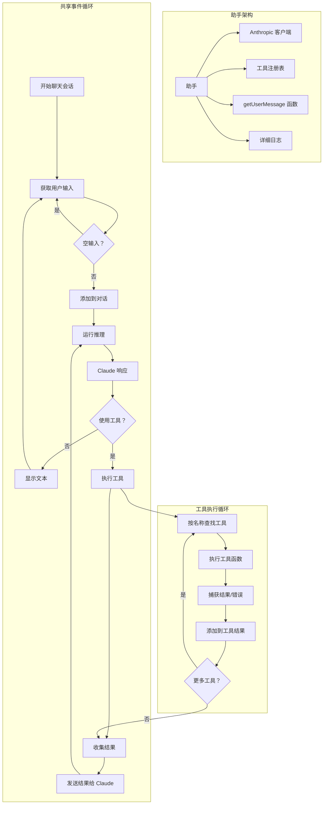

# 🧠 构建你自己的编程助手 - Python 中文版

欢迎！👋 本教程将指导你构建自己的 **AI 驱动的编程助手** —— 从基础聊天机器人开始，逐步添加文件读取、shell 命令执行、代码搜索等强大功能。

你不需要成为 AI 专家，只需跟随教程一步步构建即可！

---

## 🎯 你将学到什么

完成本教程后，你将学会如何：

- ✅ 连接 Anthropic Claude API
- ✅ 构建简单的 AI 聊天机器人
- ✅ 添加文件读取、编辑代码、运行命令等工具
- ✅ 处理工具请求和错误
- ✅ 构建一个越来越智能的助手

---

## 🛠️ 我们要构建什么

你将构建 6 个版本的编程助手，每个版本都会添加更多功能：

1. **基础聊天** —— 与 Claude 对话
2. **文件读取** —— 读取代码文件
3. **文件浏览** —— 列出文件夹中的文件
4. **命令运行** —— 运行 shell 命令
5. **文件编辑** —— 修改文件
6. **代码搜索** —— 使用模式搜索代码库



最终，你将拥有一个强大的本地开发助手！

---

## 🧱 工作原理（架构）

每个助手都是这样工作的：

1. 等待你的输入
2. 将输入发送给 Claude
3. Claude 可能直接回复，或者请求使用工具
4. 助手运行工具（例如读取文件）
5. 将结果发送回 Claude
6. Claude 给你最终答案

我们称之为 **事件循环** —— 就像助手的心跳一样。



---

## 🚀 开始上手

### ✅ 前置要求

* Python 3.8+
* Anthropic API 密钥

### 🔧 设置环境

```bash
# 安装依赖
pip install -r requirements.txt
```

### 🔐 添加 API 密钥

```bash
export ANTHROPIC_API_KEY="你的-api-密钥-在这里"
```

---

## 🏁 从基础开始

### 1. `chat.py` — 基础聊天

一个简单的与 Claude 对话的聊天机器人。

```bash
python chat.py
```

* ➡️ 试试："你好！"
* ➡️ 添加 `--verbose` 查看详细日志

---

## 🛠️ 逐步添加工具

### 2. `read_file.py` — 读取文件

现在 Claude 可以读取你电脑上的文件了。

```bash
python read_file.py
```

* ➡️ 试试："读取 fizzbuzz.js 文件"

---

### 3. `list_files.py` — 浏览文件夹

让 Claude 查看你的目录。

```bash
python list_files.py
```

* ➡️ 试试："列出这个文件夹中的所有文件"
* ➡️ 试试："fizzbuzz.js 里有什么？"

---

### 4. `bash_tool.py` — 运行 shell 命令

允许 Claude 运行安全的终端命令。

```bash
python bash_tool.py
```

* ➡️ 试试："运行 git status"
* ➡️ 试试："使用 bash 列出所有 .py 文件"

---

### 5. `edit_tool.py` — 编辑文件

Claude 现在可以 **修改代码**、创建文件并进行更改。

```bash
python edit_tool.py
```

* ➡️ 试试："创建一个 Python hello world 脚本"
* ➡️ 试试："在 fizzbuzz.js 顶部添加注释"

---

### 6. `code_search_tool.py` — 搜索代码

使用模式搜索（基于 [ripgrep](https://github.com/BurntSushi/ripgrep)）。

```bash
python code_search_tool.py
```

* ➡️ 试试："在 Python 文件中查找所有函数定义"
* ➡️ 试试："搜索 TODO 注释"

---

## 🧪 示例文件（已包含）

1. `fizzbuzz.js`: 用于文件读取和编辑
2. `riddle.txt`: 一个有趣的文本文件来探索
3. `AGENT.md`: 关于项目环境的信息

---

## 🐞 故障排除

**API 密钥不起作用？**

* 确保已导出：`echo $ANTHROPIC_API_KEY`
* 在 [Anthropic 控制台](https://www.anthropic.com) 检查配额

**Python 错误？**

* 运行 `pip install -r requirements.txt`
* 确保使用 Python 3.8 或更高版本

**工具错误？**

* 使用 `--verbose` 获取完整错误日志
* 检查文件路径和权限

---

## 💡 工具如何工作（底层原理）

工具就像插件。你需要定义：

* **名称**（例如，`read_file`）
* **输入模式**（需要什么信息）
* **函数**（它做什么）

Python 中的工具定义示例：

```python
tool_definition = {
    "name": "read_file",
    "description": "读取文件内容",
    "input_schema": {
        "type": "object",
        "properties": {
            "path": {"type": "string", "description": "文件路径"}
        },
        "required": ["path"]
    }
}
```

---

## 🧭 学习路径：通过构建学习

| 阶段 | 重点关注 |
| ----- | ------------------------------------------------ |
| **1** | `chat.py`: API 集成和响应处理 |
| **2** | `read_file.py`: 工具系统，模式生成 |
| **3** | `list_files.py`: 多个工具，文件系统 |
| **4** | `bash_tool.py`: shell 执行，错误捕获 |
| **5** | `edit_tool.py`: 文件编辑，安全检查 |
| **6** | `code_search_tool.py`: 模式搜索，ripgrep |

---

## 🚀 下一步做什么？

完成教程后，尝试构建：

* 自定义工具（例如 API 调用器、网络爬虫）
* 工具链（按顺序运行工具）
* 记忆功能（跨会话记住事情）
* 助手的 Web UI
* 与其他 AI 模型集成

---

## 📦 总结

本教程帮助你：

* 理解助手架构
* 学会构建智能助手
* 逐步增长能力
* 练习 Claude 和 Python 的结合使用

---

祝你探索愉快，构建自己的 AI 驱动工具！💻✨

如果有问题或想法，欢迎 fork 仓库、提交 issue 或联系社区！